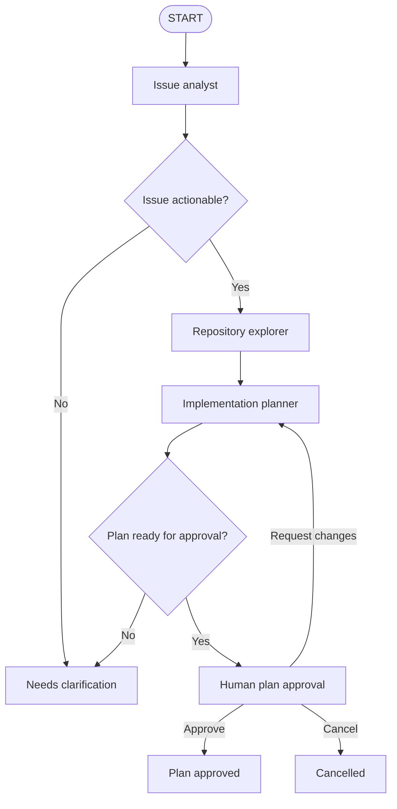

# GitHub Issue-to-Implementation Agent Pipeline

A multi-agent workflow that turns a GitHub issue into a repository-grounded,
human-approved implementation plan. The project combines LangGraph orchestration,
structured LLM outputs, read-only repository tools, checkpointed approval, and an
asynchronous FastAPI interface.

> **Current milestone:** issue analysis, repository exploration, implementation
> planning, and human approval are implemented. Code editing, test execution on
> generated changes, automated review, and pull-request publication are planned
> for a later milestone.

## Why this project exists

GitHub issues often describe intent without identifying the relevant code,
constraints, or tests. This pipeline separates that work into focused roles so
each stage produces a validated artifact for the next one:

1. Understand the requested behavior.
2. Decide whether the issue is actionable.
3. Inspect the repository using bounded, read-only tools.
4. Build an evidence-based implementation plan.
5. Pause for a human to approve, revise, or cancel the plan.

## Architecture



The workflow uses explicit LangGraph edges instead of making every role a ReAct
agent. The issue analyst and implementation planner perform deterministic,
schema-constrained generation. The repository explorer is the tool-using agent
because it must iteratively search and inspect repository evidence.

## Agent roles

| Role | Input | Output | Responsibility |
| --- | --- | --- | --- |
| Issue analyst | `IssueInput` | `IssueBrief` | Extract requirements, acceptance criteria, scope, risks, and open questions. |
| Repository explorer | `IssueBrief` and local repository | `RepositoryMap` | Find relevant files, symbols, conventions, tests, and repository-specific risks. |
| Implementation planner | `IssueBrief` and `RepositoryMap` | `ImplementationPlan` | Produce ordered implementation steps and planned tests without editing code. |
| Plan approval | `ImplementationPlan` | `PlanApprovalDecision` | Interrupt execution for approval, revision feedback, or cancellation. |

All artifacts are validated with Pydantic before they are placed in the shared
LangGraph state.

## Repository exploration tools

The explorer receives seven tools scoped to one trusted local repository:

| Tool | Purpose |
| --- | --- |
| `gather_repository_context` | Detect project structure, languages, manifests, lockfiles, tests, CI configuration, and Git status. |
| `list_repository_files` | List files matching a bounded glob. |
| `search_repository_files` | Search repository text for issue-related concepts and symbols. |
| `read_repository_file` | Read a bounded line range from one file. |
| `read_repository_files` | Read a small batch of related files. |
| `get_recent_git_history` | Inspect recent commits when history helps explain a design decision. |
| `inspect_python_file` | Parse Python AST structure without importing or executing repository code. |

Safety controls include repository-root path validation, `.git` exclusion,
binary and oversized-file rejection, output limits, fixed read-only subprocess
commands, and no shell execution of model-provided commands.

## Technology

- Python 3.11+
- LangGraph and LangChain
- OpenAI chat models with structured output
- FastAPI
- Pydantic
- Pytest and Ruff

## Project structure

```text
src/
├── agents/
│   ├── graph/
│   │   ├── approvals.py       # Human interrupt node
│   │   ├── routing.py         # Conditional graph routes
│   │   ├── state.py           # Shared AgentState
│   │   └── workflow.py        # LangGraph construction
│   ├── tools/
│   │   ├── python_tools.py
│   │   └── repository_tools.py
│   ├── implementer.py         # Read-only implementation planner
│   ├── issue_analyst.py
│   ├── repo_explorer.py
│   └── shared.py              # Cached prompt loading
├── api/
│   ├── app.py
│   ├── routes.py
│   ├── schemas.py
│   └── service.py
├── prompts/
│   ├── implementation_planner/
│   ├── issue_analyst/
│   └── repository_explorer/
└── schemas/
    ├── approval.py
    ├── issue.py
    ├── planning.py
    └── repository.py

tests/unit/                     # Offline agent, graph, API, and tool tests
```

## Getting started

### 1. Create a virtual environment

```bash
python3.11 -m venv .venv
source .venv/bin/activate
```

### 2. Install dependencies

```bash
python -m pip install --upgrade pip
python -m pip install -r requirements.txt
```

The repository explorer uses [ripgrep](https://github.com/BurntSushi/ripgrep)
for bounded file discovery and search. On macOS:

```bash
brew install ripgrep
```

### 3. Configure the model

Create a local `.env` file:

```dotenv
OPENAI_API_KEY=your-api-key
OPENAI_MODEL=your-model-name
```

The `.env` file is ignored by Git and must never be committed.

### 4. Start the API

```bash
PYTHONPATH=src uvicorn api.app:app --reload
```

The API documentation is available at
[`http://127.0.0.1:8000/docs`](http://127.0.0.1:8000/docs), and health can be
checked with:

```bash
curl http://127.0.0.1:8000/health
```

## API usage

### Start a workflow run

`repository_path` must be an existing absolute path to a trusted local
repository.

```bash
curl -X POST http://127.0.0.1:8000/api/runs \
  -H "Content-Type: application/json" \
  -d '{
    "issue": {
      "repository": "owner/example-repository",
      "number": 42,
      "title": "Prevent password reset token reuse",
      "body": "Invalidate a password reset token after its first successful use and add regression coverage.",
      "labels": ["bug", "security"],
      "comments": [
        {
          "author": "maintainer",
          "body": "Do not change the existing expiration window for unused tokens."
        }
      ]
    },
    "repository_path": "/absolute/path/to/example-repository"
  }'
```

The server generates a unique `thread_id`. Actionable issues progress through
repository exploration and planning, then return with `plan_approval` in
`pending_nodes`. Non-actionable issues finish with `needs_clarification`.

### Inspect a run

```bash
curl http://127.0.0.1:8000/api/runs/THREAD_ID
```

### Approve a plan

```bash
curl -X POST http://127.0.0.1:8000/api/runs/THREAD_ID/decision \
  -H "Content-Type: application/json" \
  -d '{"action": "approve"}'
```

### Request plan changes

Revision feedback routes the workflow back to the implementation planner.

```bash
curl -X POST http://127.0.0.1:8000/api/runs/THREAD_ID/decision \
  -H "Content-Type: application/json" \
  -d '{
    "action": "request_changes",
    "feedback": "Add an integration-test step covering token reuse."
  }'
```

To stop a run instead, submit `{"action": "cancel"}`.

## State and status model

Each run begins with an `IssueInput` and absolute `repository_path`. Nodes add
artifacts to the shared state rather than mutating earlier artifacts:

```text
IssueInput
  → IssueBrief
  → RepositoryMap
  → ImplementationPlan
  → PlanApprovalDecision
```

Important statuses include:

- `ready_for_exploration`
- `repository_explored`
- `ready_for_plan_review`
- `needs_clarification`
- `plan_revision_requested`
- `plan_approved`
- `cancelled`

The default API uses LangGraph's in-memory checkpointer. A thread can be resumed
while the server process remains alive, but state is lost when the process
restarts.

## Testing

The test suite uses fake structured model responses, so tests do not make live
OpenAI API calls.

```bash
PYTHONPATH=src python -m pytest -q
ruff check src tests
```

Coverage includes schema validation, prompt rendering, conditional routing,
human approval and revision, checkpointer behavior, API lifecycle handling,
repository-tool safety, and Python AST inspection.

## Current limitations and roadmap

- GitHub issues are submitted through the API; webhook ingestion is not yet
  implemented.
- The default checkpointer is in-memory rather than durable SQLite or Postgres.
- Repository tools are read-only; the workflow does not modify source files.
- Generated code is not yet executed in an isolated worktree or sandbox.
- Automated test-runner, reviewer, retry-policy, and pull-request publisher
  nodes are not yet implemented.
- Live-model evaluation and production telemetry are not yet included.

The intended next-stage workflow is:

```text
approved plan
  → isolated Git worktree
  → controlled code writer
  → sandboxed test runner
  → reviewer and bounded revision loop
  → draft pull request
```

## Design principles

- **Structured boundaries:** every model-generated artifact is schema validated.
- **Least privilege:** only the explorer receives repository tools, and those
  tools are read-only.
- **Explicit control flow:** LangGraph edges make routing and stopping conditions
  visible and testable.
- **Human authority:** implementation cannot proceed without an explicit plan
  decision.
- **Offline testing:** fake agent responses keep tests deterministic and free of
  external API calls.
